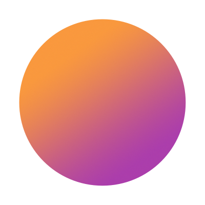

# NiceNotifications



> **[Nice Photon](https://nicephoton.com) is available for hire!** Talk to us if you have any iOS app development needs. We have 10+ years of experience making iOS apps for top Silicon Valley companies. Reach out at [hi@nicephoton.com](mailto:hi@nicephoton.com)

**NiceNotifications** reimagines local notifications on Apple platforms.

It gives developers a new way to manage notification scheduling, permissions and grouping.

At its most basic form, it helps to schedule local notifications easily, in a declarative way.

At its most advanced, it introduces a whole new way of looking at local notifications, with the concept of "Notification Timelines", similar to `WidgetKit` or `ClockKit` APIs.

Built at **[Nice Photon](https://nicephoton.com)**.  
Maintainer: [@dreymonde](https://github.com/dreymonde)

As of now, **NiceNotifications** is in early beta. Some APIs is likely to change between releases. Breaking changes are to be expected. Feedback on the API is very welcome!

## Usage

```swift
import NiceNotifications

LocalNotifications.schedule(permissionStrategy: .askSystemPermissionIfNeeded) {
    EveryMonth(forMonths: 12, starting: .thisMonth)
        .first(.friday)
        .at(hour: 20, minute: 15)
        .schedule(title: "First Friday", body: "Oakland let's go!")
}
```

## Basics Guide

### Scheduling a one-off notification

```swift
// `NotificationContent` is a subclass of `UNNotificationContent`.
// You can also use `UNNotificationContent` directly
let content = NotificationContent(
    title: "Test Notification",
    body: "This one is for a README",
    sound: .default
)

LocalNotifications.schedule(
    content: content,
    at: Tomorrow().at(hour: 20, minute: 15),
    permissionStrategy: .scheduleIfSystemAllowed
)
```

### What is `permissionStrategy`?

In most cases, **NiceNotifications** will handle all the permission stuff for you. So you can feel free to schedule notifications at any time, and permission strategy will take care of permissions.

Basic permission strategies:

1. `askSystemPermissionIfNeeded` - if the permission was already given, will proceed to schedule. If the permission was not yet asked, it will ask for system permission, and then proceed if successful. If the permission was rejected previously, it will not proceed.
2. `scheduleIfSystemAllowed` - will only proceed to schedule if the permission was already given before. Otherwise, will do nothing.

### What is `Tomorrow().at( ... )`?

**NiceNotifications** uses **[DateBuilder](https://github.com/nicephoton/DateBuilder)** to help define notification trigger dates in a simple, clear and easily readable way. Please refer to **[DateBuilder README](https://github.com/nicephoton/DateBuilder)** for full details.

Here's a short reference:

```swift
Today()
    .at(hour: 20, minute: 15)

NextWeek()
    .weekday(.saturday)
    .at(hour: 18, minute: 50)

EveryWeek(forWeeks: 10, starting: .thisWeek)
    .weekendStartDay
    .at(hour: 9, minute: 00)

EveryDay(forDays: 30, starting: .today)
    .at(hour: 19, minute: 15)
    
ExactlyAt(account.createdAt)
    .addingDays(15)
    
WeekOf(account.createdAt)
    .addingWeeks(1)
    .lastDay
    .at(hour: 10, minute: 00)

EveryMonth(forMonths: 12, starting: .thisMonth)
    .lastDay
    .at(hour: 23, minute: 50)

NextYear().addingYears(2)
    .firstMonth.addingMonths(3) // April (in Gregorian)
    .first(.thursday)

ExactDay(year: 2020, month: 10, day: 5)
    .at(hour: 10, minute: 15)

ExactYear(year: 2020)
    .lastMonth
    .lastDay
```

### Scheduling multiple notifications

```swift
LocalNotifications.schedule(permissionStrategy: .scheduleIfSystemAllowed) {
    Today()
        .at(hour: 20, minute: 30)
        .schedule(title: "Hello today", sound: .default)
    Tomorrow()
        .at(hour: 20, minute: 45)
        .schedule(title: "Hello tomorrow", sound: .default)
} completion: { result in
    if result.isSuccess {
        print("Scheduled!")
    }
}
```

### Scheduling recurring notifications

> **WARNING!** iOS only allows you to have no more than 64 scheduled local notifications, the rest will be silently discarded. [(Docs)](https://developer.apple.com/documentation/uikit/uilocalnotification)

```swift
func randomContent() -> NotificationContent {
    return NotificationContent(title: String(Int.random(in: 0...100)))
}

LocalNotifications.schedule(permissionStrategy: .askSystemPermissionIfNeeded) {
    EveryDay(forDays: 30, starting: .today)
        .at(hour: 20, minute: 30, second: 30)
        .schedule(with: randomContent)
}
```

For recurring content based on date:

```swift
func content(forTriggerDate date: Date) -> NotificationContent {
    // create content based on date
}

LocalNotifications.schedule(permissionStrategy: .askSystemPermissionIfNeeded) {
    EveryDay(forDays: 30, starting: .today)
        .at(hour: 20, minute: 30, second: 30)
        .schedule(with: content(forTriggerDate:))
}
```

### Cancelling notification groups

```swift
let group = LocalNotifications.schedule(permissionStrategy: .askSystemPermissionIfNeeded) {
    EveryDay(forDays: 30, starting: .today)
        .at(hour: 15, minute: 30)
        .schedule(title: "Hello!")
}

// later:

LocalNotifications.remove(group: group)
```

### Asking permission without scheduling

```swift
LocalNotifications.requestPermission(strategy: .askSystemPermissionIfNeeded) { success in
    if success {
        print("Allowed")
    }
}
```

### Getting current system permission status

```swift
LocalNotifications.SystemAuthorization.getCurrent { status in
    switch status {
    case .allowed:
        print("allowed")
    case .deniedNow:
        print("denied")
    case .deniedPreviously:
        print("denied and needs to enable in settings")
    case .undetermined:
        print("not asked yet")
    }
    if status.isAllowed {
        print("can schedule!")
    }
}
```

### Scheduling directly with `UNNotificationRequest`

If you just want to use the permission portion of **NiceNotifications** and create `UNNotificationRequest` instances yourself, use `.directSchedule` function:

```swift
let trigger = UNTimeIntervalNotificationTrigger(timeInterval: 360, repeats: true)

let content = UNMutableNotificationContent()
content.title = "Repeating"
content.body = "Every 6 minutes"
content.sound = .default

let request = UNNotificationRequest(
    identifier: "repeating_360",
    content: content,
    trigger: trigger
)

LocalNotifications.directSchedule(
    request: request,
    permissionStrategy: .askSystemPermissionIfNeeded
) // completion is optional
```

## Installation

### Swift Package Manager
1. Click File &rarr; Swift Packages &rarr; Add Package Dependency.
2. Enter `http://github.com/nicephoton/NiceNotifications.git`

## Acknowledgments

Built at **[Nice Photon](https://nicephoton.com)**

Special thanks to:

 - [@camanjj](https://github.com/camanjj) for his valuable feedback on the API
